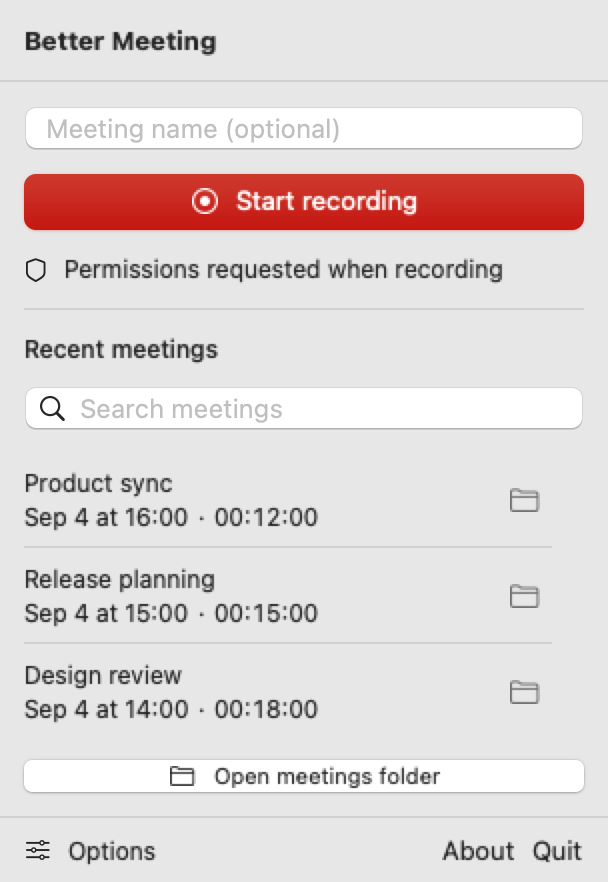

# Better Meeting

Record a display, system audio, and microphone from the macOS menu bar. After
recording stops, Whisper transcribes the audio locally. Each meeting gets a
folder with the video, audio, and transcript, accessible from a Finder button.

Requires an Apple Silicon Mac and macOS 15 or newer.



The app's menu, shown with fictional meetings.

## Install with Homebrew

```bash
brew tap kremnyi/better-meeting https://github.com/kremnyi/better-meeting
brew install --cask kremnyi/better-meeting/better-meeting
open -a "Better Meeting"
```

The cask downloads the app from [GitHub Releases](https://github.com/kremnyi/better-meeting/releases)
and verifies its SHA-256 checksum. You can also download the ZIP there, extract
it, and move the app to `/Applications`. Xcode is not required.

Releases use a self-signed certificate, without an Apple Developer ID or notarization. If
macOS blocks the first launch, try opening the app, then use **System Settings
→ Privacy & Security → Open Anyway**. See [Apple's instructions](https://support.apple.com/102445).
Managed Macs may not allow this exception.

Open **About** in the menu footer to see the installed version and release page.
**Check for Updates** contacts GitHub when clicked and reports whether a newer
release is available. For apps installed with Homebrew at `/opt/homebrew`,
**Update with Homebrew** opens Terminal, quits the app, and reopens it after a
successful update. Finish any recording or transcription first. ZIP installations
use the release-page download.

To update with Homebrew, finish any active recording, quit the app, and run:

```bash
brew update
brew upgrade --cask kremnyi/better-meeting/better-meeting
```

Version 0.3.5 changes the signing identity. After upgrading from 0.3.4 or older,
grant Screen Recording and Microphone access again. Later releases reuse the same
certificate so macOS can recognize the app across updates. Uninstalling the app
keeps saved meetings.

## Record a meeting

1. Open the app. If needed, it downloads and prepares the multilingual Whisper
   `large-v3-turbo` model in the background. The menu shows progress; you can start
   recording during setup. Transcription waits until the model is ready. If setup
   fails, use **Retry setup**.
2. Enter a meeting name or leave it empty for automatic naming.
3. Open **Options** in the bottom-left corner to choose a display, microphone, and save folder.
   The app remembers these choices. Defaults are the main display, system
   microphone, and `~/Documents/Better Meetings`.
4. Start recording and grant **Screen & System Audio Recording** and
   **Microphone** access. Restart the app if prompted after granting screen access.
5. Stop recording and wait for transcription. Click the folder button beside the
   finished meeting to open its files in Finder.

While recording, separate microphone and system-audio meters show incoming sound.
An empty meter can mean silence; check the selected input if it stays empty while
you expect sound.

Options also include **Resolution** and **Frame rate**, defaulting to
1440 px and 10 fps. Resolution limits the video's longest edge to 1280, 1440,
1920, or 2560 pixels. It uses Retina pixels, preserves the display's proportions,
and never upscales smaller displays. Frame rate sets a maximum of 5, 10, or
30 fps. Higher settings can increase file size and processing load; macOS manages
compression bitrate. These settings do not affect audio or transcription.

**Model** offers multilingual Small, Large v3 Turbo (default), and Large v3.
Small uses less memory; Large v3 takes longer and uses more memory. Each model
is downloaded once and then works offline. Changing models releases the previous
model before loading the next one. The picker waits for active setup to finish.

**Decoding → Advanced…** exposes temperature, fallback attempts and temperature
increase, no-speech and log-probability thresholds, and the repetition threshold.
Defaults match the existing transcription behavior. Reset restores decoding
defaults without changing the selected model. Model and decoding settings are
saved with each transcript; retries reuse them and changed settings invalidate
cached passes. These are WhisperKit controls, not arbitrary Python Whisper flags.

**Language** defaults to **Auto**, with Ukrainian, Russian, and English as candidates.
Following the original project's strategy, Auto transcribes the whole recording
in each candidate language separately, then merges segments by confidence and filters likely silence
hallucinations. Choose one language for a single pass. The app remembers your choice.
Three languages require three passes; progress shows the current language and pass.
Change **Candidates** to match the languages you expect. Each selected language
adds one pass; at least one is required. Single-language mode supports any language
listed by WhisperKit.

Use **Vocabulary** in Options for names, companies, and technical terms separated
by commas. These optional hints use Whisper's existing prompt support and stay on
your Mac. The app remembers them; changing hints reruns the affected language passes.

The menu shows the 10 most recent completed meetings. Search finds matching titles
and saved transcript text across all completed meetings in the selected folder,
including older meetings and manual Markdown edits. Search runs locally.
If transcription fails,
use **Retry transcription** or **Finish saved recording** to resume from saved
audio or video, including after a restart. Quit waits for an active recording
and its transcript to finish saving. Force Quit or power loss can leave an
unfinished video that cannot be recovered.

**Cancel transcription** stops processing and keeps the recording and completed
language passes. Use **Finish saved recording** to resume later, even after a restart.

Each completed language pass is saved as `pass_uk.json`, `pass_ru.json`, or
`pass_en.json` in the meeting folder. Retry reuses matching passes and reruns any
missing or damaged ones. Changing the audio, model, or decoding options invalidates
the affected cache. Finished transcripts are not regenerated automatically.

Right-click a completed meeting to **Copy Transcript** or **Rename…**. Copy uses
the saved Markdown, including any edits. Rename updates the folder, title, and
metadata while keeping the transcript body and media files.

**Re-transcribe…** lets you choose languages and vocabulary for a saved meeting.
It reuses matching passes and keeps the current transcript available until the
replacement is ready. A successful run replaces the transcript, including manual
edits, while preserving the meeting name. Cancellation or failure keeps the old files.

Before your first recording or retry, the app asks permission to send completion
notifications. Allow them to see when transcription finishes or needs attention;
clicking a notification opens that meeting's folder. You can change this in
macOS **System Settings → Notifications → Better Meeting**.

## Meeting files and titles

```text
2026-09-04 14.30.00 — Product sync/
├── recording.mp4
├── audio.m4a
├── transcript.md
├── transcript.json
├── pass_uk.json
├── pass_ru.json
├── pass_en.json
└── metadata.json
```

`transcript.md` has timestamps and a link to the video. `transcript.json` stores
segment times, text, and language tags. `metadata.json` stores the title,
recording date, duration, file names, and transcription status.

For unnamed meetings, Apple's `NaturalLanguage` framework looks for a person,
company, or product and a repeated topic. A discussion with Anna about a pricing
review might become `Anna — Pricing Review`. The folder, Markdown heading, and
metadata use the same title. Existing folders are never overwritten.

Naming needs no additional model or API. Product names use a heuristic based on
repeated capitalized nouns; recognition varies with the transcript and language
support on the Mac. If no usable name and topic are found, the date-based name
remains. Typed titles and titles from older folders are preserved.

## Privacy and model storage

Recording, transcription, and automatic naming run on your Mac. The app does not
upload meetings. The first speech-model setup downloads files from Hugging Face;
after successful setup, transcription works offline. Removing or damaging those
files can require another download.

Model files live under `~/Documents/huggingface/models/argmaxinc/whisperkit-coreml/`.
Tokenizer files may also be stored under
`~/Documents/huggingface/models/openai/whisper-large-v3/`. WhisperKit calls the
turbo model `openai_whisper-large-v3-v20240930`; its model files total about 1.6 GB.
Upgrading from `small` requires this download once. Existing model files are kept.
The first load can take longer while Core ML prepares the model.

## Build from source

Install Xcode 16 or newer, then run:

```bash
git clone https://github.com/kremnyi/better-meeting.git
cd better-meeting
./scripts/build-app.sh
open "dist/Better Meeting.app"
```

The script builds the app bundle with its icons, permission descriptions, and
license notices. Use this bundle for recording; `swift run BetterMeeting` lacks
those resources. The app has no Dock icon.

See [CONTRIBUTING.md](CONTRIBUTING.md) for tests, signing, and release steps.

## Limits

- Captures one whole display; window-only and audio-only modes are not available.
- One recording or transcription runs at a time.
- Transcripts have timestamps and language tags, but no speaker labels.
- Whisper can produce text during silence; the no-speech filter does not catch every case.
- File import, live captions, and meeting summaries are not included.
- The selected display and microphone must be connected when recording starts.

## Project origin and license

This macOS app is based on [GivenFLY/better-meeting](https://github.com/GivenFLY/better-meeting),
which processes existing recordings. The original implementation remains in
that repository and this fork's Git history.

Licensed under [Apache License 2.0](LICENSE). See [NOTICE](NOTICE) for attribution
and [ThirdPartyNotices.md](ThirdPartyNotices.md) for WhisperKit notices.
